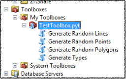

# Spark GDB Library

A library for parsing and querying an [Esri File Geodatabase](http://www.esri.com/news/arcuser/0309/files/9reasons.pdf) with Apache Spark.

This work in progress is a pure Scala read-only implementation based on [this](https://github.com/rouault/dump_gdbtable/wiki/FGDB-Spec) reverse engineered specification.
Understanding the internal file structure enables partitioning to perform massive parallel reading.
The reading API is based on the [Hadoop File System API](https://hadoop.apache.org/docs/r2.7.1/api/index.html?org/apache/hadoop/fs/FileSystem.html) enabling the placement of the GDB in HDFS or S3 (not tested) for multi node access.
There is still a lot to be done, but is a good start. Eventually, I will merge this project with my [Ibn Battuta Project](https://github.com/mraad/ibn-battuta).

## Building From Source

This project build process is based on [Apache Maven](https://maven.apache.org/)

```bash
export SPARK_LOCAL_IP=localhost
mvn install
```

The test data in `src/test/resources/Test.gdb` was generated using the ArcPy Tool `src/test/python/TestToolbox.pyt`



Thought the coordinates of the shapes are random, the coordinates values are placed as attributes for testing.
In the case of the `Points` feature class, the x/y coordinate values should match the values in the attributes `X` and `Y` enabling cross checking during testing.

## Using with Spark shell

```bash
$SPARK_HOME/bin/spark-shell --packages com.esri:spark-gdb:0.7
```

```scala
import org.apache.spark.sql.gdb.core._
import org.apache.spark.sql.gdb.udf._
sc.gdbFile("src/test/resources/Test.gdb", "Points", numPartitions = 2).map(row => {
  row.getAs[PointType](row.fieldIndex("Shape"))
}).foreach(println)
```

```scala
val df = sqlContext.read.
    format("org.apache.spark.sql.gdb").
    option("path", "src/test/resources/Test.gdb").
    option("name", "Points").
    load()
df.printSchema()
df.registerTempTable("points")
sqlContext.sql(s"select * from points").show()
```

### Using UDT and UDFs

For the Spatial UDT (User Defined Types), I am following the `VectorUDT` implementation.

```scala
val df = sqlContext.read
  .format("org.apache.spark.sql.gdb")
  .option("path", path)
  .option("name", name)
  .option("numPartitions", "1")
  .load()

df.printSchema()
df.registerTempTable(name)

sqlContext.udf.register("getX", (point: PointType) => point.x)
sqlContext.udf.register("getY", (point: PointType) => point.y)
sqlContext.udf.register("plus2", (point: PointType) => PointType(point.x + 2, point.y + 2))

sqlContext.sql(s"select getX(plus2(Shape)),getX(Shape) as y from $name")
  .show(20)
```
## Testing In HDFS (Yet Another Excuse To Use Docker :-)

We will use [Docker](https://www.docker.com/) to bootstrap a [Cloudera quickstart](https://www.cloudera.com/content/www/en-us/documentation/enterprise/latest/topics/quickstart_docker_container.html) container instance.

I **highly** recommend the installation of the [Docker Toolbox](https://www.docker.com/docker-toolbox) for a Docker quick start.

Compile the project with the `quickstart` profile:
```bash
mvn -Pquickstart clean package
```

Create a local docker enabled machine using 6 cores, 8GB of RAM and with 10 GB of virtual disk:
```bash
docker-machine create\
 --driver virtualbox\
 --virtualbox-cpu-count 6\
 --virtualbox-memory 8192\
 --virtualbox-disk-size 10240\
 --virtualbox-no-vtx-check\
 quickstart
```

On Windows, I had to upgrade my machine instance:
```bash
docker-machine upgrade quickstart
```

Set up the docker environment:
```bash
eval $(docker-machine env quickstart)
```

Start a single node Hadoop instance with ZooKeeper, HDFS, YARN and Spark.
(This is a **4GB** download, so go grab some coffee and walk your dog, it is gonna take a while ! But, you only have to do that once. Ah... the beauty of docker images :-)
We expose the ports for Cloudera Manager (7180), Hue (8888) and NameNode (50070).
And to facilitate the moving of jars and test data from the host into the container, we map the `/Users` host folder onto the container `/Users` folder.
```bash
docker run\
 --privileged=true\
 --hostname=quickstart.cloudera\
 -v /Users:/Users\
 -p 7180:7180\
 -p 8888:8888\
 -p 50070:50070\
 -p 50075:50075\
 -p 21050:21050\
 -t -i cloudera/quickstart:latest\
 /usr/bin/docker-quickstart
```

Copy `Test.gdb` to HDFS:

```bash
hadoop fs -mkdir /data
hadoop fs -put /Users/<YOUR_PATH>/spark-gdb/src/test/resources/Test.gdb /data
```

Start A Spark shell:
```bash
spark-shell --jars /Users/<YOUR_PATH>/spark-gdb/target/spark-gdb-0.7.jar
```

Submit a Spark Context job:
```scala
import org.apache.spark.sql.gdb.core._
import org.apache.spark.sql.gdb.udf.PointType
sc.gdbFile("hdfs:///data/Test.gdb", "Points", numPartitions = 2).map(row => {
  row.getAs[PointType](row.fieldIndex("Shape"))
}).foreach(println)
```

Submit a SQL Context job:
```scala
val df = sqlContext.read.
    format("org.apache.spark.sql.gdb").
    option("path", "hdfs:///data/Test.gdb").
    option("name", "Lines").
    option("numPartitions", "2").
    load()
df.registerTempTable("lines")
sqlContext.sql("select * from lines").show()
```

#### Notes to self

set terminal type in windows to enable cursor movement:
```
set term=ansi
```

Start a CM instance:
```
/home/cloudera/cloudera-manager --express
```
